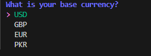
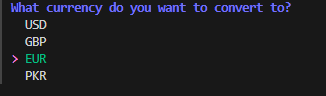
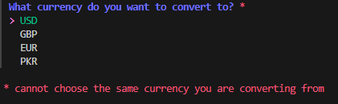
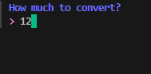
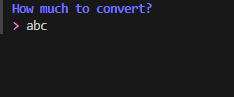
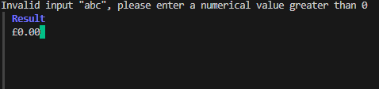
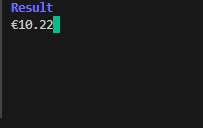

# Go_Currency_Converter

This is a currency converter in Golang that retrieves data rate values from an API: https://currencyfreaks.com/ 
The charmbracelet/huh TUI framework is implemented for displaying the menu options for the currency converter: https://github.com/charmbracelet/huh 

Upon running the program, the user is prompted to input the currency they will be converting from: 

After entering the base currency, the user is prompted to input the currency they want to convert to: 

However, if the currency that the user wants to convert to is the same as their base currency, they will see the following error message: 

If the user correctly inputs a different currency to convert to, they will be prompted to enter the amount they would like to convert from their base currency: 

If the user inputs an invalid value (non-numerical or numerical value less than or equal to 0), they will see the following error message: 
 

If a valid numerical value is entered, the user will get their converted currency value: 

